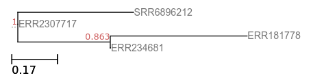

## CS4255 2019 Project Instructions for FastTree and Pindel ##
- [Morgan N. Price, et al., FastTree: Computing Large Minimum Evolution Trees with Profiles instead of a Distance Matrix, Molecular Biology and Evolution, 26(7), 2009, pp. 1641–1650][fast-paper]
- [Kai Ye, et al., Pindel: a pattern growth approach to detect break points of large deletions and medium sized insertions from paired-end short reads, Bioinformatics, 25(21), 2009, pp. 2865–2871][pin-paper]


# Problem statement #


### Script ###
You will be given 2 input files: an alignment file of 24 bacterial strains on which you will use your FastTree implementation to generate a phylogenetic tree, and a collection of paired-end reads mapped to a reference genome, and from these mappings you are asked to find the locations of breakpoints using your Pindel code.

__Inputs:__ 
1. A [muliple sequence alignment file](https://github.com/AbeelLab/cs4255/blob/master/fasttree-input.fasta) for FastTree
2. [Sam file](https://github.com/AbeelLab/cs4255/blob/master/pindel-mapped.sam) containing paired-end reads mapped to a reference genome for Pindel <br/>
You can find the sequence files for the paired reads [`pindel_reads1.fq`](https://github.com/AbeelLab/cs4255/blob/master/pindel-reads1.fq) and [`pindel-reads2.fq`](https://github.com/AbeelLab/cs4255/blob/master/pindel-reads2.fq), and the reference genome [`pindel-ref.fasta`](https://github.com/AbeelLab/cs4255/blob/master/pindel-ref.fasta). <br/>
 
 __Output:__ A phylogenetic tree in [Newick format](http://en.wikipedia.org/wiki/Newick_format) and the coordinates of breakpoints, including the number of reads that support each breakpoint.

---

# Testing your code #

## Test data ##
#### 1. FastTree ####
You can find a small input to test your code [here (`fasttree-reallysmall.fasta`)](https://github.com/AbeelLab/cs4255/blob/master/fasttree-reallysmall.fasta), it contains 4 sequences aligned to each other:
```
>ERR234681
GGACAGACCGGACACGGGT
>ERR181778
GGACAGGCCGGACGCGGGT
>SRR6896212
ACNACGACTGACCATAAGG
>ERR2307717
AGNACGACTGAACACGGGT
``` 
The correct output tree for these sequences is:


#### 2. Pindel ####
There is a small reference genome of length 1000bp [`pindel-ref_reallysmall.fasta`](), and your are given 285 paired-end reads in [`pindel_reads1_reallysmall.fq`](https://github.com/AbeelLab/cs4255/blob/master/pindel-reads1_reallysmall.fq) and [`pindel-reads2_reallysmall.fq`](https://github.com/AbeelLab/cs4255/blob/master/pindel-reads2_reallysmall.fq). You can also find the alignment file [here](https://github.com/AbeelLab/cs4255/blob/master/pindel-mapped_reallysmall.sam)

Reference sequence contains a deletion of length 100bp at position 150 (0-based index) and an insertion of 10bp at position 500 (0-based index).

---

# Some useful notes  #
## 1. FastTree ##
Here is a quick recap of the method: the notes below are from the [reference paper][fast-paper] and the [project website][fast-web]. It is **strongly advised** that you also read through the project website AND the supplementary text; method is described in a little more detail there.


### 1.1 Heuristic Neighbor-Joining ###


FastTree uses several heuristics to improve the neighbor joining algorithm: 
- Instead of a distance matrix, profiles are stored for the internal nodes.
 
	**Example:** If we join two leaves *i* and *j*, and *i* has an A at a position and *j* has a G, then the profile of *ij* at that position will be 50% A and 50% G (and 0% for other characters). 

- A "top-hits" heuristic is used to avoid computing all pairwise distances and to avoid considering all possible joins.

	Before doing any joins, FastTree estimates these top-hits lists for all *N* sequences by assuming that if A and B have similar sequences, then the top-hits lists of A and B will largely overlap. 

	**Example:** Compute the 2*m* top hits of node A (2 is a safety factor). Then, for each node B within the top *m* hits of A that does not already have a top-hits list, estimate the top hits of B by comparing B to the top 2*m* hits of A.

- The list of top-hits is stored for each node.

	After a join, FastTree computes the top-hits list for the new node by comparing the node to all entries in the top-hits lists of its children. If after a join some of the other nodes' top hits point to an inactive (joined) node, these entries are replaced with the active ancestor. 
	
	FastTree periodically "refreshes" the top-hits list by comparing the new node to all other nodes and also by comparing each of the new node's top-hits to each other.

- The best joins are stored for each node (*fast neighbor-joining*)

	Moreover, the best joins of a node are updated each time a better join is found.

	**Example:** While computing the top hits list of A, FastTree might discover that A,V is a better join than B,best(B), and update the best joins of B.

- A hill-climbing search for better joins from a candidate join is performed (*relaxed neighbor joining*).

	First, the best *m* joins are found among the best-known joins of the *n* active nodes, without recomputing the Neighbor-Joining criterion to reflect the current out-distances. Then, the Neighbor-Joining criterion is recomputed for these *m* candidates and the best ones are selected. 

	Next, FastTree does a local hill-climbing search to find a better join.

	**Example:** Given a join AB, FastTree considers all joins A,C or B,D, where C is in top-hits(A) or D is in top-hits(B). This can be beneficial because the out-distances change after every join, so the best join for a node can change as well. 


### 1.2 Nearest Neighbor Interchanges (NNI) ###


Once we obtain our initial rough topology, we need to use NNIs to improve it: 
- At each round, FastTree tests and possibly rearranges each split in the tree, and it recomputes the profile of each internal node. **Note that the profiles can change even if the topology does not change because FastTree recomputes the weighting of the joins.**

	By default, FastTree does log<sub>2</sub>(*N*) + 1 rounds of NNIs. Number of rounds is fixed to ensure fast completion.

- The minimum evolution criterion prefers ((A, B), (C, D)) over alternate topologies ((A, C), (B, D)) or ((A, D), (B, C)) if d(A,B) + d(C,D) < d(A,C) + d(B,D) and d(A,B) + d(C,D) < d(A,D) + d(B,C). 

	Here, FastTree uses **log-corrected profile distances**, rather than distances between nodes. The profile distances do not account for the distances within the nodes, but this does not affect the minimum evolution criterion as it increases all distances d(A, ·) by the same amount.

### 1.3 Local Bootstrap ###

To estimate the support for each split, FastTree resamples the alignment's columns with [Knuth's 2002 random number generator](http://www-cs-faculty.stanford.edu/knuth/programs/rng.c). 
- FastTree counts the fraction of resamples that support a split over the two potential NNIs around that node, much as it does while using NNIs to improve the topology. If a resample's minimum evolution criterion gives a tie, then that resample is counted as not supporting the split.

### 1.4 Branch Lengths ###

Once the topology is complete, FastTree computes branch lengths:


for internal branches and 


for the branch leading to leaf A, where d are log-corrected profile distances.

### 1.5 Unique Sequences ###
Large alignments often contain many sequences that are exactly identical to each other. Before inferring a tree, FastTree uses hashing to quickly identify redundant sequences. It constructs a tree for the unique subset of sequences and then creates multifurcating nodes, without support values, as parents of the redundant sequences.

## 2. Pindel ##
These notes are from the [reference article](https://doi.org/10.1093/bioinformatics/btp394), please refer to the text for further details.

- Overview of the method: given a set of paired-end reads aligned to a reference genome, we first examine the alignment and keep the pared reads that only one end was mapped to the reference. The mapped end is used to determine **the anchor point** on the reference genome as well as **the direction** of the unmapped read. Once these two are known, we can locate the sub-region in the reference genome, where we can break the unmapped read into 2 (deletion) or 3 (short insertion) fragments and map the two terminal fragment separately.

### 2.1 Detecting large deletions ###

Some of the reads will only one end mapped to the reference genome. One of the possibilities is that the unmapped read mate spans the break point of a deletion event in the test sample compared to the reference genome as shown in figure below. 


- We need to find the appropriate position to break the unmapped read into two parts and map these separately to the reference genome. Given the position of mapped read (anchor) and the direction, we only need to search the local region at one side of the anchor point.

- The 3' end of the mapped read is defined as anchor point. Then pattern growth is used to search for minimum and maximum unique substrings from **both the 3' and 5' ends** of the unmapped read. 

	Search from the 3' end of unmapped reads within the range of two times of insert size starting from the anchor point. 

	Search from the 5' of unmapped read within the range of read length+user defined maximum deletion size starting from the already mapped 3' end of the unmapped read. 

	Examine the **unique substrings** from both ends to see whether a complete unmapped read can be constructed. All possible solutions are stored in a database for sorting according to the break point coordinates. A deletion event is reported **if at least two reads support it**. See figure below.


### 2.2 Detecting medium sized insertions ###

The procedure is very similar to that used for deletions. The only difference is that the search range for the unique occurrence of minimum and maximum unique substrings from the 5' end of the unmapped read is read length - one. In this case, we certainly cannot reconstruct the whole read and the extra bases are an inserted fragment compared to the reference genome as shown in figure below.


- Again, the 3' end of the mapped read is defined as anchor point. 

	Search for minimum and maximum unique substrings from the 3' end of unmapped reads within the range of two times of insert size starting from the anchor point. 

	Search for minimum and maximum unique substrings from the 5' of unmapped read within the range of read length – 1, starting from the already mapped 3' end of the unmapped read. 

	Examine the minimum and maximum substrings from both 3' and 5' to see whether they are adjacent to each other. The middle fragment is the inserted fragment. All possible solutions are stored in a database for sorting according to the break point coordinates. An insertion event is reported **if at least two reads support it.**


<center> <b> GOOD LUCK!! </b> </center>

[fast-paper]: https://doi.org/10.1093/molbev/msp077
[fast-web]: http://microbesonline.org/fasttree/
[pin-paper]: https://doi.org/10.1093/bioinformatics/btp394
